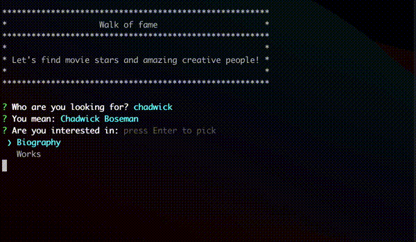

# WoF CLI

This client is a CLI application built with [kotlin-inquirer](https://github.com/kotlin-inquirer/kotlin-inquirer)

It makes use of the [wof-core](/wof-core) library (_published on local maven_) as a provider of the domain use cases.

|   |
|:-------------------------------------:|
|  |
