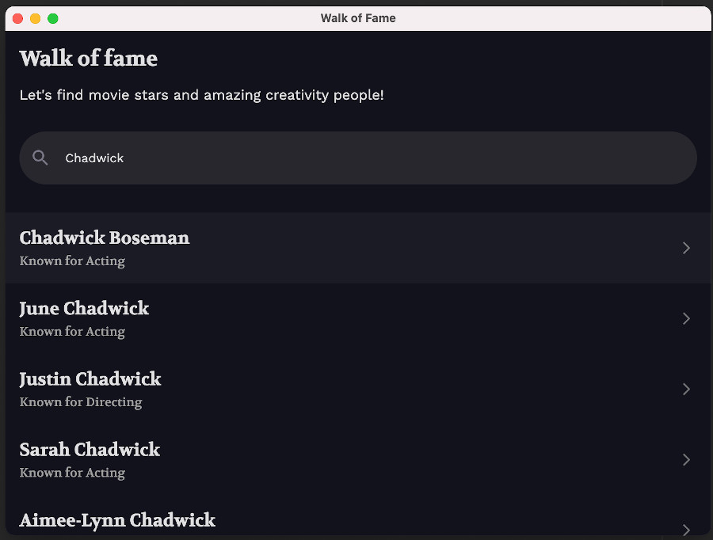
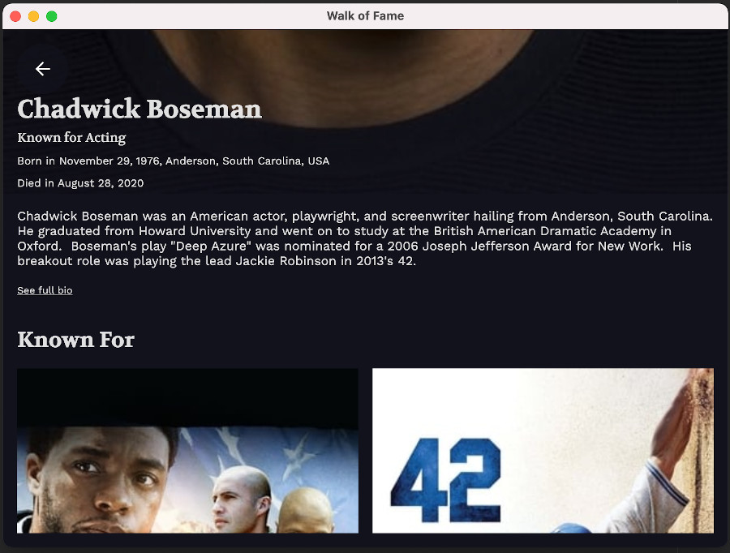
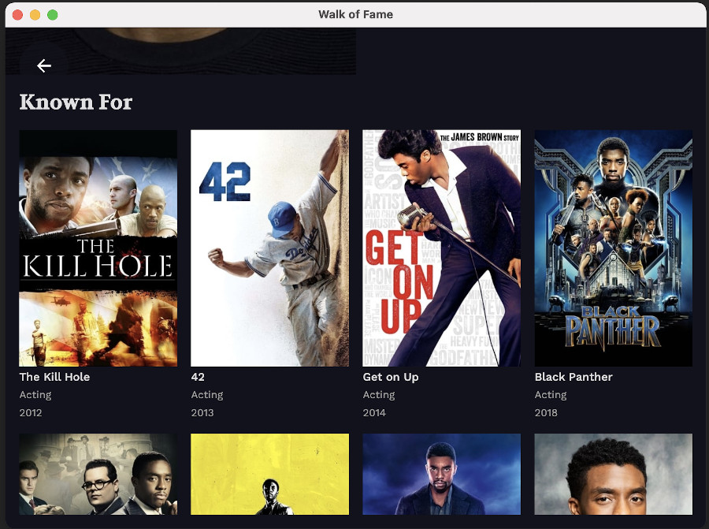

# WoF Compose

Using mostly [Compose Multiplatform](https://github.com/JetBrains/compose-jb) from Jetbrains, a
`:common` module is responsible for all but app initialization, allowing to share most of the UI code between an Android
and a Desktop clients.

It makes use of the [wof-core](/wof-core) library (_published on local maven_) as a provider of the application models
to build the composable screens.

### On Android

|  |  |
|:---------------------------------------------:|:-----------------------------------------------:|
|      |        |

 

### On Desktop (JVM)

|  | 
|:--------------------------------------------:|
|        | 
|        |

