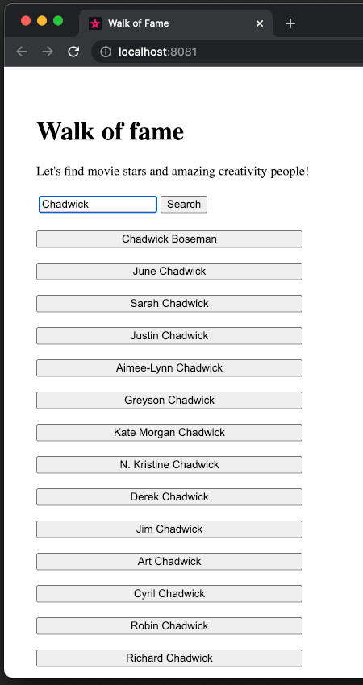
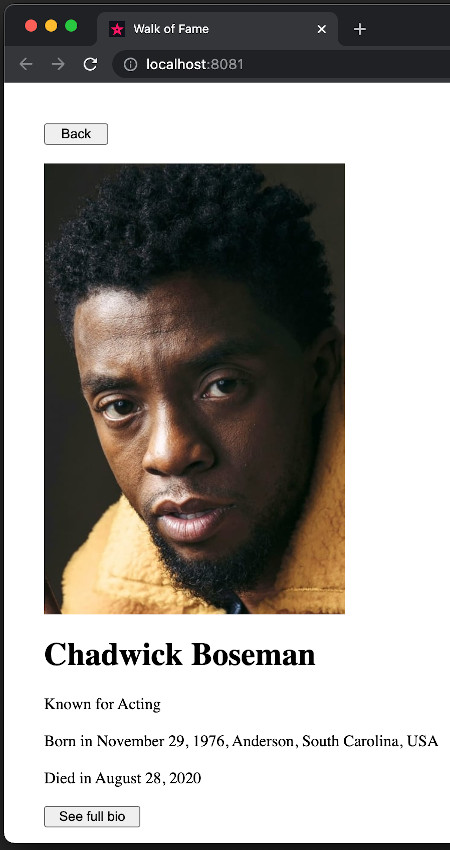
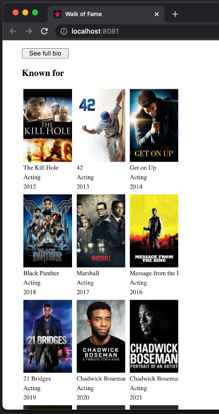
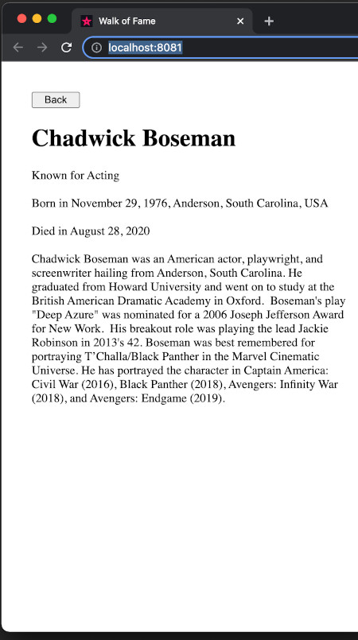

# WoF Web

This client uses [Compose for Web](https://compose-web.ui.pages.jetbrains.team/) to build its UI. As this version of
Compose differs from the Multiplatform version, using an DOM based api, it is defined in a separate project for now.
When Compose Multiplatform starts offering support for web on its widgets api, maybe we can implement a new client for
web on [wof-compose](/wof-compose) :D

It makes use of the [wof-core](/wof-core) library (_published on local maven_) as a provider of the application models
to build the composable screens.

🙇 ***Disclaimer: I am not a web developer, so the layout in this application is very crude and only follows vaguely the
structure used in the other clients. My main goal here was to validate the common app motor provided by
[wof-core](/wof-core)***

|  |  |
|:-----------------------------------------:|:-------------------------------------------:|
|      |        |
